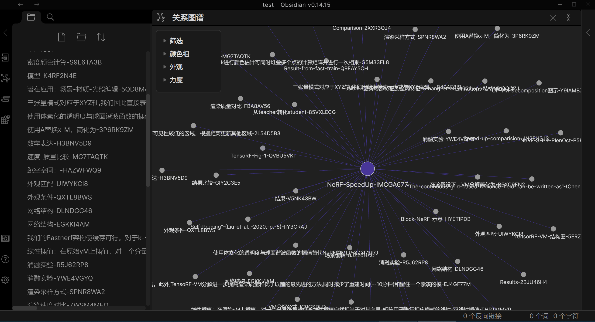
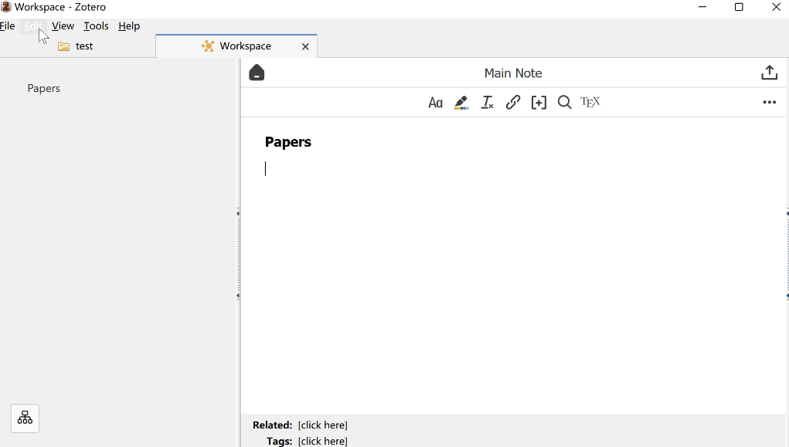
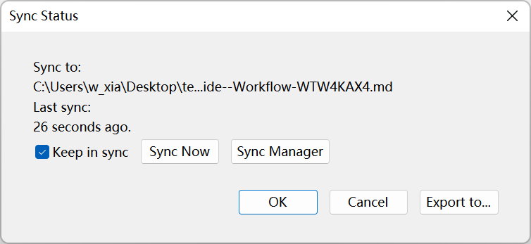
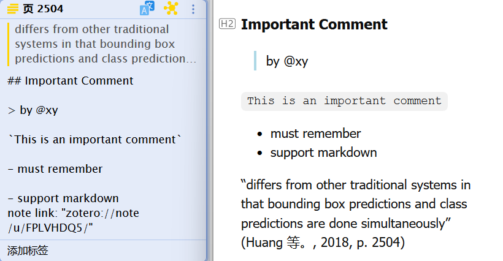
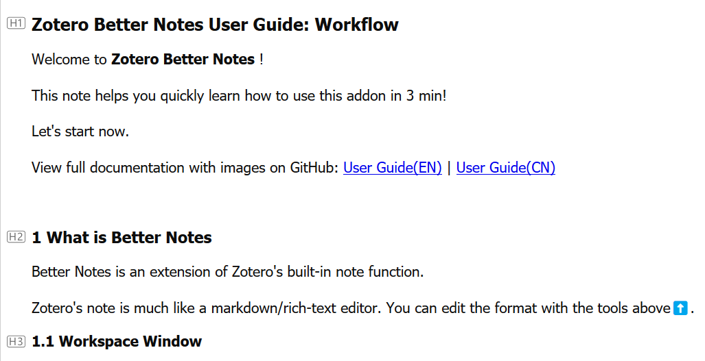

# Zotero Better Notes


Everything about note management. All in Zotero.

[Better Notes Handbook(中文 Chinese, provide translation)](https://zotero.yuque.com/staff-gkhviy/better-notes/biigg4?)

Out-dated docs: [User Guide(EN)](./UserGuide.md) | [用户指引(中文)](./UserGuideCN.md)

## Install

- Download the latest release (.xpi file) from the [Releases Page](https://github.com/windingwind/zotero-better-notes/releases)_Note_ If you're using Firefox as your browser, right-click the `.xpi` and select "Save As.."
- In Zotero click `Tools` in the top menu bar and then click `Addons`
- Go to the Extensions page and then click the gear icon in the top right.
- Select `Install Add-on from file`.
- Browse to where you downloaded the `.xpi` file and select it.
- Restart Zotero, by clicking `restart now` in the extensions list where the plugin is now listed.

## Easy to Use

> See [Handbook:Quick Start](https://zotero.yuque.com/staff-gkhviy/better-notes/gw5d7v) for more details.

New to note-taking? Install and start now!

Already an Obsidian/Logseq/... user? Archive annotations with double chain and export with just one click!

It works out of the box. No complicated and annoying configuration!

## Note Workspace

> See [Handbook:Workspace](https://zotero.yuque.com/staff-gkhviy/better-notes/yul2qm) for more details.

The workspace allows you to focus on the note, as shown in the teaser on top of the README.

- Note outline(tree view, mindmap, and bubble map)
- Note links Preview

## Bi-directional Link Support

> See [Handbook:Bi-directional Link](https://zotero.yuque.com/staff-gkhviy/better-notes/yxpiew) for more details.

The bi-directional link note(双链笔记) is supported. Link your notes inside Zotero with just one click.

Export with its' linked sub-notes to Obsidian:


## Note Templates

> See [Handbook:Note Templates](https://zotero.yuque.com/staff-gkhviy/better-notes/un54wc) for more details.

Use customized templates to import data from items/notes!


[Learn more about template](./Template.md)

See what templates can do and find templates contributed by the community here: [Note Templates from Community](https://github.com/windingwind/zotero-better-notes/issues/85)

## Export

> See [Handbook:Export](https://zotero.yuque.com/staff-gkhviy/better-notes/nxlngg) for more details.

- To new note in Zotero
- To MarkDown file(embed or link, with images)
- To MS Word document(.docx)
- To PDF document(.pdf)

## Syncing: Note->MarkDown

> See [Handbook:Sycn](https://zotero.yuque.com/staff-gkhviy/better-notes/aid2c3) for more details.

> We are planning to have a two-path syncing for note<->MarkDown. Discuss here: https://github.com/windingwind/zotero-better-notes/issues/147

Keeping the MarkDown version of your notes in sync with the latest changes inside Zotero is extremely easy now.

Just click 'Auto Sync to Export Path' the first time you export your note. Do not require any third-party tools!



## Other Features

> See [Handbook:Other Features](https://zotero.yuque.com/staff-gkhviy/better-notes/sh4v2y) for more details.

- Annotation2Note  
   </img>  
  Create a note from annotation by just on click. `markdown` is supported!

- Heading mark  
  </img>

- Cite Items(`"` button)

- Image resizing(right click on images)

- ...

## Development & Contributing

This addon is built based on the [Zotero Addon Template](https://github.com/windingwind/zotero-addon-template).

### Build

```shell
# A release-it command: version increase, npm run build, git push, and GitHub release
# You need to set the environment variable GITHUB_TOKEN https://github.com/settings/tokens
# release-it: https://github.com/release-it/release-it
npm run release
```

Alternatively, build it directly using build.js: `npm run build`

### Debug

1. Copy zotero command line config file. Modify the commands.

```sh
cp zotero-cmd-default.json zotero-cmd.json
```

2. Setup addon development environment following this [link](https://www.zotero.org/support/dev/client_coding/plugin_development#setting_up_a_plugin_development_environment).

3. Build addon and restart Zotero with this npm command.

```sh
npm run restart
```

You can also debug code in these ways:

- Test code segments in Tools->Developer->Run Javascript;
- Debug output with `Zotero.debug()`. Find the outputs in Help->Debug Output Logging->View Output;
- UI debug. Zotero is built on the Firefox XUL framework. Debug XUL UI with software like [XUL Explorer](https://udn.realityripple.com/docs/Archive/Mozilla/XUL_Explorer).
  > XUL Documents:  
  > https://www.xul.fr/tutorial/  
  > http://www.xulplanet.com/

## Disclaimer

Use this code under AGPL (open source required). No warranties are provided. Keep the laws of your locality in mind!

Part of the code of this repo refers to other open-source projects within the allowed scope.

- [zotero-pdf-translate](https://github.com/windingwind/zotero-pdf-translate)

## My Other Zotero Addons

- [zotero-pdf-preview](https://github.com/windingwind/zotero-pdf-preview) PDF preview for Zotero
- [zotero-pdf-translate](https://github.com/windingwind/zotero-pdf-translate) PDF translation for Zotero 6
- [zotero-tag](https://github.com/windingwind/zotero-tag) Automatically tag items/Batch tagging

## Sponsor Me

I'm windingwind, an active Zotero(https://www.zotero.org) plugin developer. Devoting to making reading papers easier.

Sponsor me to buy a cup of coffee. I spend more than 24 hours every week coding, debugging, and replying to issues in my plugin repositories. The plugins are open-source and totally free.

If you sponsor more than $10 a month, you can list your name/logo here and have priority for feature requests/bug fixes!
