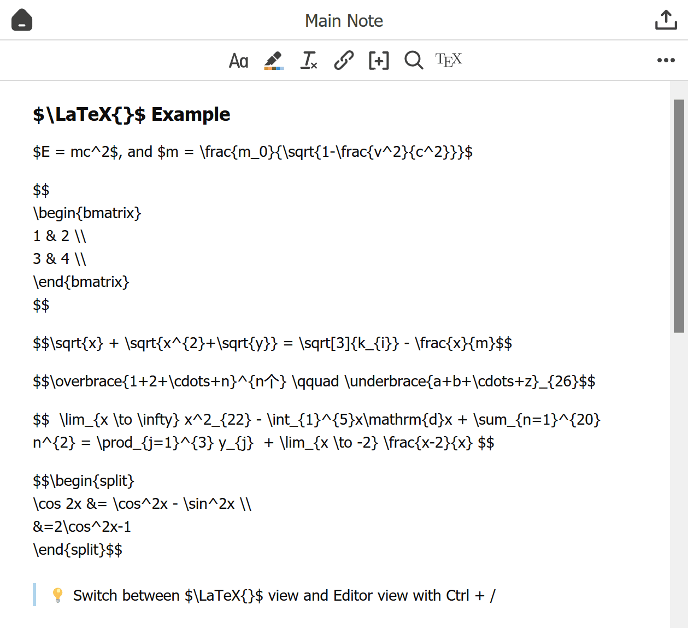

# Zotero Better Notes


Everything about note management. All in Zotero.

[Better Notes Handbook(Chinese, provide translation)](https://zotero.yuque.com/books/share/f3fe159f-956c-4f10-ade3-c87559cacb60/biigg4) | [User Guide(EN)](./UserGuide.md) | [用户指引(中文)](./UserGuideCN.md)

## Easy to Use

New to note-taking? Install and start now!

Already an Obsidian/Logseq/... user? Archive annotations with double chain and export with just one click!

It works out of the box. No complicated and annoying configuration!

## Bi-directional Link Support

Bi-directional link note(双链笔记) is supported! Link your notes inside Zotero with just one click.

Export with its' linked sub-notes to Obsidian:


## Templates

Use customized templates to import data from items/notes!


[Learn more about template](./Template.md)

See what templates can do and find templates contributed by the community here: [Template Market](https://github.com/windingwind/zotero-better-notes/issues/85)

## Auto-Sync to Files

Keep the MarkDown version of your notes in sync with the latest changes inside Zotero is extremely easy now!

Just click 'Auto Sync to Export Path' the first time you export your note. Do not require any third-party tools!

And the linked sub-notes will also be updated automatically!


## Note Enhancements

- `LaTex` view  
   </img>  
  For multiline math, please use `shift+enter` to change line.

- Annotation2Note  
   </img>  
  Create a note from annotation by just on click. `markdown` is supported!

- Heading mark  
  </img>

- Cite Items
- Image resizing(comming soon)

# Quick Start Guide

## Install

- Download the latest release (.xpi file) from the [Releases Page](https://github.com/windingwind/zotero-better-notes/releases)_Note_ If you're using Firefox as your browser, right-click the `.xpi` and select "Save As.."
- In Zotero click `Tools` in the top menu bar and then click `Addons`
- Go to the Extensions page and then click the gear icon in the top right.
- Select `Install Add-on from file`.
- Browse to where you downloaded the `.xpi` file and select it.
- Restart Zotero, by clicking `restart now` in the extensions list where the
  Zotero PDF Translate plugin is now listed.

## Usage

### All in Zotero: Best Note Practice

https://user-images.githubusercontent.com/33902321/167992626-34adfd97-c2df-48b0-b9ff-e245bd792d5c.mp4

For new users, a **User Guide** will help you get started quickly and create a user guide note for you. Use it as a playground and explore your own workflow!

### Important Changes

- Since v0.2.0, most of the workspace bottom-left buttons are moved to menu bar.
- Since v0.5.0, workspace will open as a Zotero tab by default. `Menu -> File -> Open in New Window` or press `shift` while clicking the Open Workspace button to use the standalone mode.

Documentation:  
[User Guide(EN)](./UserGuide.md) | [用户指引(中文)](./UserGuideCN.md)

## Development & Contributing

This add-on is built on the Zotero Addon Template of [zotero-pdf-translate](https://github.com/windingwind/zotero-pdf-translate).

### Build

```shell
# A release-it command: version increase, npm run build, git push, and GitHub release
# You need to set the environment variable GITHUB_TOKEN https://github.com/settings/tokens
# release-it: https://github.com/release-it/release-it
npm run release
```

Alternatively, build it directly using build.js: `npm run build`

### Build Steps

1. Clean `./builds`
2. Copy `./addon` to `./builds`
3. Esbuild to `./builds/addon/chrome/content/scripts`
4. Replace `__buildVersion__` and `__buildTime__` in `./builds/addon`
5. Zip the `./builds/addon` to `./builds/*.xpi`

### Debug

1. Copy zotero command line config file. Modify the commands.

```sh
cp zotero-cmd-default.json zotero-cmd.json
```

2. Setup addon development environment following this [link](https://www.zotero.org/support/dev/client_coding/plugin_development#setting_up_a_plugin_development_environment).

3. Build addon and restart Zotero with this npm command.

```sh
npm run restart
```

You can also debug code in these ways:

- Test code segments in Tools->Developer->Run Javascript;
- Debug output with `Zotero.debug()`. Find the outputs in Help->Debug Output Logging->View Output;
- UI debug. Zotero is built on the Firefox XUL framework. Debug XUL UI with software like [XUL Explorer](https://udn.realityripple.com/docs/Archive/Mozilla/XUL_Explorer).
  > XUL Documents:  
  > https://www.xul.fr/tutorial/  
  > http://www.xulplanet.com/

## Disclaimer

Use this code under AGPL (open source required). No warranties are provided. Keep the laws of your locality in mind!

Part of the code of this repo refers to other open-source projects within the allowed scope.

- [zotero-pdf-translate](https://github.com/windingwind/zotero-pdf-translate)

## My Other Zotero Addons

- [zotero-pdf-preview](https://github.com/windingwind/zotero-pdf-preview) PDF preview for Zotero
- [zotero-pdf-translate](https://github.com/windingwind/zotero-pdf-translate) PDF translation for Zotero 6
- [zotero-tag](https://github.com/windingwind/zotero-tag) Automatically tag items/Batch tagging

## Sponsor Me

I'm windingwind, an active Zotero(https://www.zotero.org) plugin developer. Devoting to making reading papers easier.

Sponsor me to buy a cup of coffee. I spend more than 24 hours every week coding, debugging, and replying to issues in my plugin repositories. The plugins are open-source and totally free.

If you sponsor more than $10 a month, you can list your name/logo here and have priority for feature requests/bug fixes!
