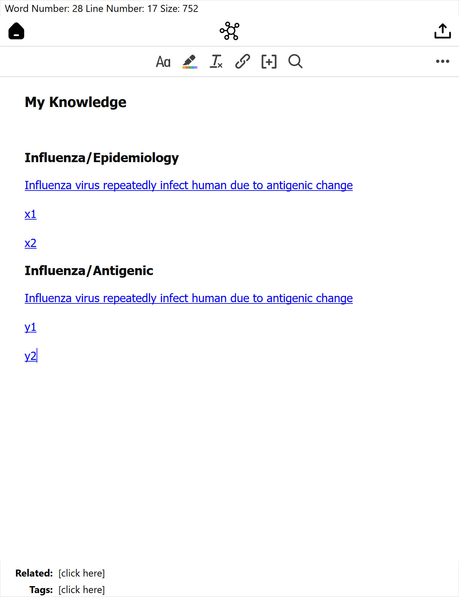
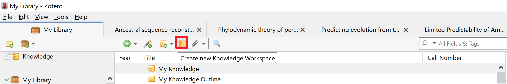
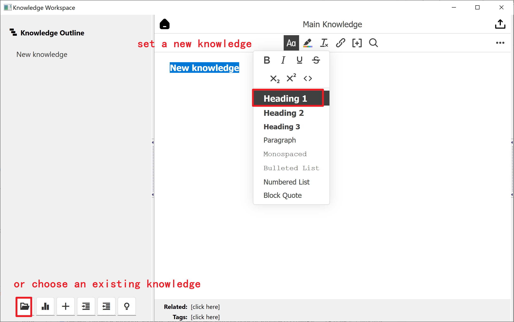
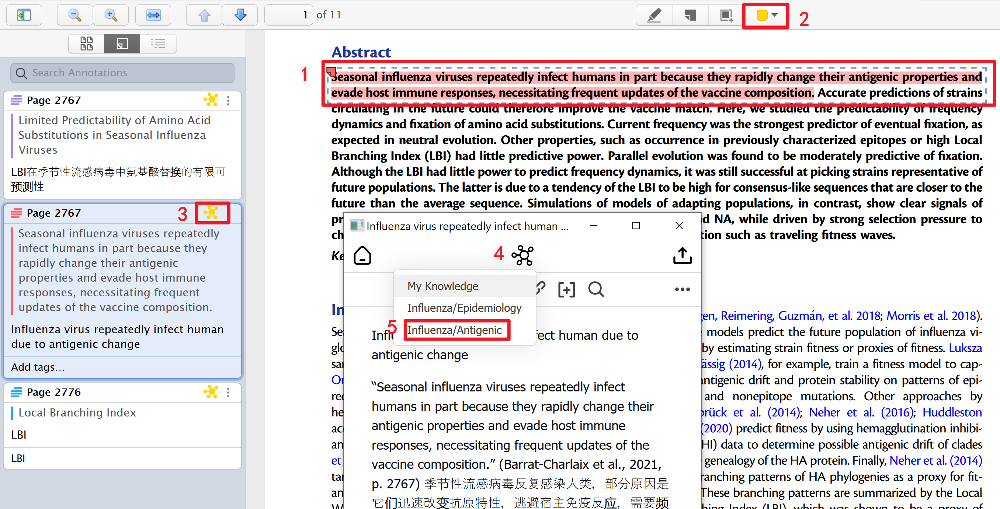
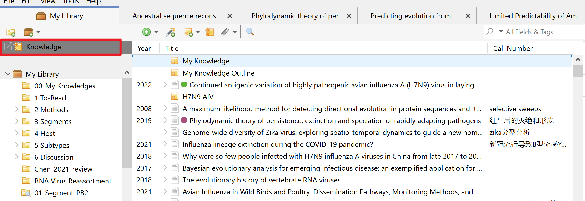
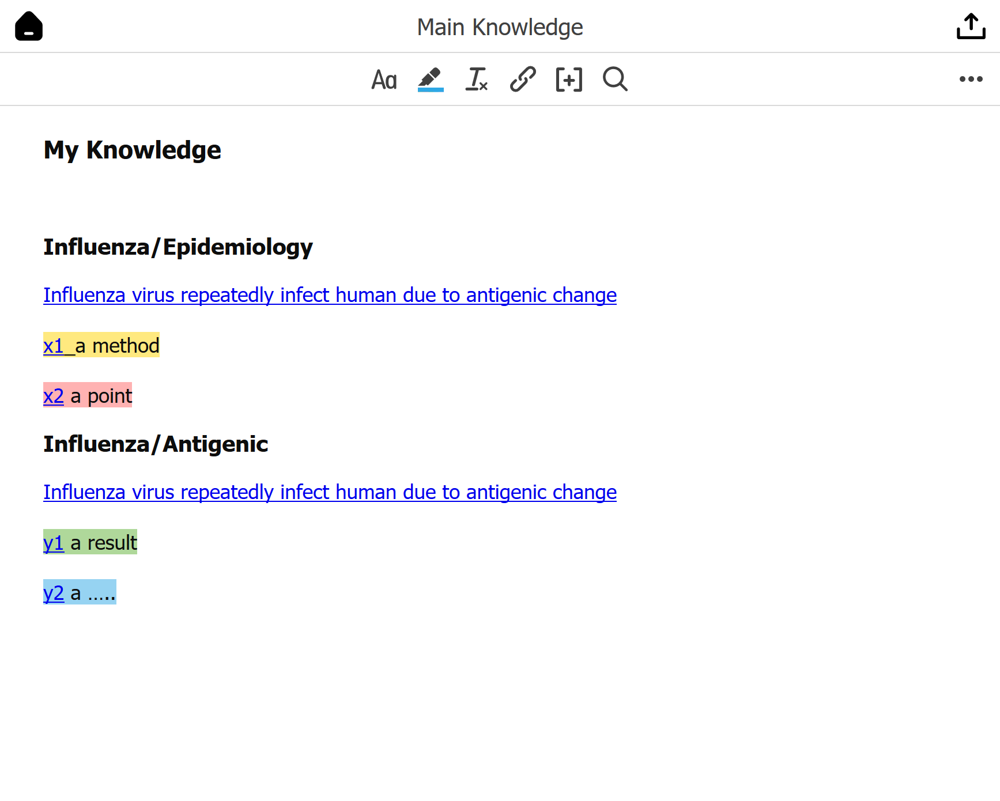

# Knowledge4Zotero

Knowledge management for Zotero!

# Quick Start Guide

## Install

- Download the latest release (.xpi file) from the [Releases Page](https://github.com/windingwind/zotero-pdf-translate/releases)_Note_ If you're using Firefox as your browser, right-click the `.xpi` and select "Save As.."
- In Zotero click `Tools` in the top menu bar and then click `Addons`
- Go to the Extensions page and then click the gear icon in the top right.
- Select `Install Add-on from file`.
- Browse to where you downloaded the `.xpi` file and select it.
- Restart Zotero, by clicking `restart now` in the extensions list where the
  Zotero PDF Translate plugin is now listed.

## Introduction

**Note**: an atomized **note** including a point, or a method described in a paper, or your thoughts while reading the paper, or anything else you drew from a paper.

A note in Zotero looks something like this (below), with quote sentences and your own thoughts.

**Knowledge**: Simply, knowledge = note**s**.

**Knowledge Workspace**: a place to manage your **notes** in a hierarchical outline.

## Usage

### Set a new knowledge

After the plugin installtion, click the menu on the top panel to "create new knowledge workspace".

### Add note to knowledge

select some sentences you interested (1) and add to pdf annotation (2);

put some thoughts when you are reading these sentences and add to the certain place of knowledge (3 - 5);

Add an existing note to your knowledge

### Manage your knowledge

Open your knowledge

manage your notes after you added from pdf annotation

### Backlinks

Go back to the paper from your knowledge (bi-directional links or backlinks). 

Click the note and Zotero link, back to the paper when you need (this is my favorite part).

## Development & Contributing

This add-on is built on the Zotero Addon Template of [zotero-pdf-translate](https://github.com/windingwind/zotero-pdf-translate).

## Disclaimer

Use this code under AGPL (open source required). No warranties are provided. Keep the laws of your locality in mind!

Part of the code of this repo refers to other open-source projects within the allowed scope.

- [zotero-pdf-translate](https://github.com/windingwind/zotero-pdf-translate)
