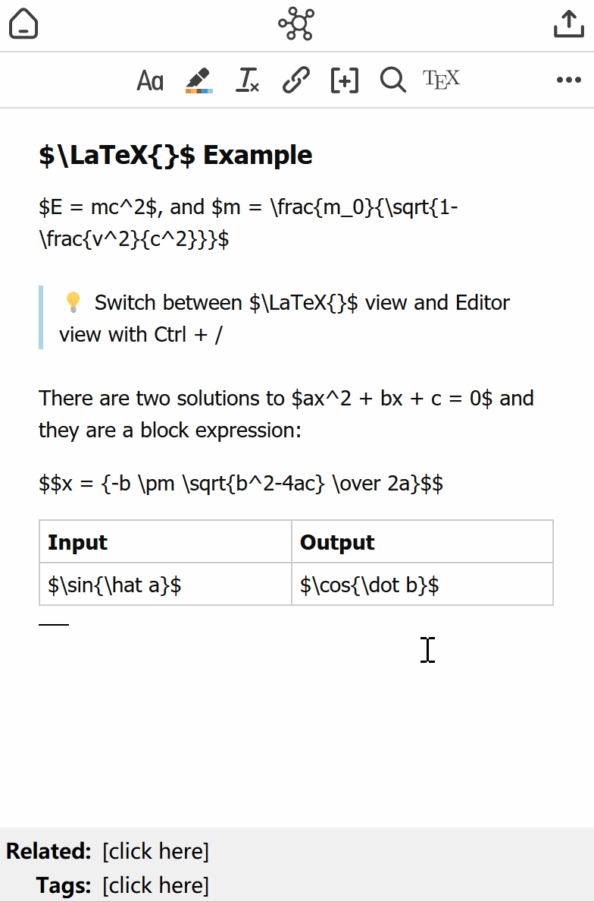

# Zotero Better Notes

Everything about note management. All in Zotero.

[User Guide(EN)](./UserGuide.md) | [用户指引(中文)](./UserGuideCN.md)

## All in Zotero: Best Note Practice

https://user-images.githubusercontent.com/33902321/167992626-34adfd97-c2df-48b0-b9ff-e245bd792d5c.mp4

## Features

- `LaTex` view supported(v0.4.0). Click the `Tex` button in the toolbar or `Ctrl/⌘+'/'` to switch between editor view & LaTex view!  
  </img>
- Archive notes/annotations in one place with just a click;
- Foward-link to sub-notes and back-link to PDF attachments;
- Export archived notes in MarkDown/rich-text format.
  - Export markdown with images is supported in v0.1.1
- Use templates to customize your note! [Document](./Template.md). Discuss & contribute your template [here](https://github.com/windingwind/zotero-better-notes/issues/23)

# Quick Start Guide

## Install

- Download the latest release (.xpi file) from the [Releases Page](https://github.com/windingwind/zotero-better-notes/releases)_Note_ If you're using Firefox as your browser, right-click the `.xpi` and select "Save As.."
- In Zotero click `Tools` in the top menu bar and then click `Addons`
- Go to the Extensions page and then click the gear icon in the top right.
- Select `Install Add-on from file`.
- Browse to where you downloaded the `.xpi` file and select it.
- Restart Zotero, by clicking `restart now` in the extensions list where the
  Zotero PDF Translate plugin is now listed.

## Usage

For new users, a **User Guide** will help you get started quickly and create a user guide note for you. Use it as a playground and explore your own workflow!

Documentation:  
[User Guide(EN)](./UserGuide.md) | [用户指引(中文)](./UserGuideCN.md)

## Development & Contributing

This add-on is built on the Zotero Addon Template of [zotero-pdf-translate](https://github.com/windingwind/zotero-pdf-translate).

## Disclaimer

Use this code under AGPL (open source required). No warranties are provided. Keep the laws of your locality in mind!

Part of the code of this repo refers to other open-source projects within the allowed scope.

- [zotero-pdf-translate](https://github.com/windingwind/zotero-pdf-translate)

## My Other Zotero Addons

- [zotero-pdf-translate](https://github.com/windingwind/zotero-pdf-translate) PDF translation for Zotero 6
- [zotero-tag](https://github.com/windingwind/zotero-tag) Automatically tag items/Batch tagging
