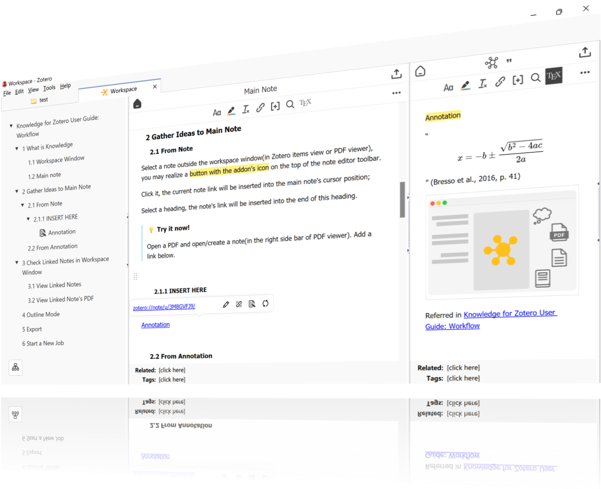

# Better Notes for Zotero

[](https://www.zotero.org)
[](https://github.com/windingwind/zotero-plugin-template)
[](https://t.me/boost/bnzotero)

<div align=center></img></div>

Everything about note management. All in Zotero.

Join the community on Telegram: [@bnzotero](https://t.me/boost/bnzotero)

## 🧩 Outline

[🧐 What is this?](#-what-is-this)

[🤔 What can it do?](#-what-can-it-do)

[👋 Install](#-install)

[😎 Quick start](#-quick-start)

<details style="text-indent: 2em">
<summary>More</summary>

[Getting Started by Opening a Note Tab](#getting-started-by-opening-a-note-tab)

[Note Editor](#note-editor)

[Note Link](#note-link)

[Note Template](#note-template)

[Syncing: Note 🔄️ Markdown](#syncing-note-%EF%B8%8F-markdown)

[Note Export](#note-export)

[GPT Integration](#gpt-integration)

[Action Workflow](#action-workflow)

[Other Features](#other-features)

</details>

[🧲 API](#-api)

[🔧 Development](#-development)

[🔔 Disclaimer](#-disclaimer)

[🔎 My Zotero Plugins](#-my-zotero-plugins)

[🫶 Sponsors](#-sponsors)

[🤗 Contributors](#-contributors)

## 🧐 What is this?

Better Notes (BN) is a plugin for [Zotero](https://zotero.org).

BN streamlines your workflows of:

- paper reading
- annotating
- note taking
- metadata analyzing
- knowledge exporting
- AI writing assistant

and:

- works out of the box
- highly customizable
- all in Zotero

## 🤔 What can it do?

🖇️ Connect knowledge fragments with _note link_. With one click. [Learn more →](#note-link)

🗂️ Simplify and automate knowledge analysis with extensive _note templates_. With one click. [Learn more →](#note-template)

🔄️ Keep in sync with your Markdown files. Two-way, automatically. [Learn more →](#syncing-note-%EF%B8%8F-markdown)

🖨️ Export notes to different formats: Markdown, Docx, PDF, and mind map. [Learn more →](#note-export)

📝 Enhancements for Zotero's note editor with outline, link relation, view images.... Open as much note tabs/windows as you like!

## 👋 Install

- Download the plugin (.xpi file) from below.

  - [Latest Version: 2.5.5](https://github.com/windingwind/zotero-better-notes/releases/download/v2.5.5/better-notes-for-zotero.xpi)
  - [Latest Stable](https://github.com/windingwind/zotero-better-notes/releases/latest)
  - [All Releases](https://github.com/windingwind/zotero-better-notes/releases)

  _Note_: If you're using Firefox as your browser, right-click the `.xpi` and select "Save As.."

- In Zotero click `Tools` in the top menu bar and then click `Plugins`
- Go to the Extensions page and then click the gear icon in the top right.
- Select `Install Add-on from file`.
- Browse to where you downloaded the `.xpi` file and select it.
- Finish!

## 😎 Quick start

BN offers a range of features that can be combined like Lego blocks to build your own note-taking workflow.

Start taking notes in Zotero with BN in **5 minutes**!

### Getting Started by Opening a Note Tab

> 💡 In the latest version, the workspace is no longer a thing. You can open an unlimited number of note tabs/windows, which is what we called `workspace` in the past.

To open a note in a tab, double-click/press `Enter` on the item in the library, as you would do to open an attachment. Holding `shift` opens the note in a new window.

<div align=center></img></div>

> **Explore the Note Tab!**  
> 💡 The layout from left to right is:
>
> - Outline
> - Note editor
> - Context pane (tags, related, relation graph, in/outbound links)

### Note Editor

> 💡 Where can I find the note editor?
>
> - In the note tab/window
> - In the library: click to open a note editor in the item pane
> - In the PDF reader: right-side context pane
>
> 💡 How to create a new note?  
> Click the note icon in the library tools bar (the row under the tabs bar), or from the menu - File

<div align=center></img></div>

#### Magic Key

BN enhances the note editor with a _Magic Key_ command palette, which can be opened by typing `/` in the editor or pressing `Ctrl/Cmd` + `/`. You can type or use the arrow keys to navigate the commands, and press `Enter` to execute.

<div align=center></img></div>

#### Note Link Preview

BN enhances the note editor with link preview. Hover+Ctrl/Cmd or click the link to preview the linked note without leaving the current note.

<div align=center></div>

#### Direct Markdown Paste

BN supports direct markdown paste. You can paste markdown content into the note editor, and it will be converted to the rich text format automatically.

### Note Link

To create a _note link_ between the note you are editing and another note, click the </img> button in the title bar of the note editor.

<div align=center></img></div>

> 💡 What's the difference between `Mention in` and `Link to`?
>
> `Mention in` will insert a link of the current note (from which you open the link creator) to another note (which you pick in the link creator), i.e. inbound link.
> `Link to` will insert links of picked notes to the current note, i.e. outbound link.

You can also manually copy the note link from the note editor menu.

### Note Template

Are you spending a lot of time writing summaries and copy-pasting while taking notes? Say hello to _Note Template_!

_Note Template_ is designed for tasks like:

- Summarize metadata and annotations from multiple papers, with customized filters
- Compare papers across sections
- Generate content programmatically

> 💡 Need help or looking for community templates? [See here →](https://github.com/windingwind/zotero-better-notes/discussions/categories/note-templates)
>
> 💡 Want to write/share your templates?
>
> [How to write →](docs/about-note-template.md#write-note-template)
>
> [How to share →](docs/about-note-template.md#share-your-template)

<div align=center></img></div>

### Syncing: Note 🔄️ Markdown

With BN, you can integrate your note-taking into your existing workflow seamlessly. If you use markdown editors like Obsidian, you can keep your notes in sync with external Markdown files easily.

To set up auto-sync, click `Set Auto-Sync` the first time you export your note. There is no need for any third-party tools or complicated setups!

<div align=center></img></div>

Any changes made to your note or its corresponding Markdown file will be automatically synced. This feature makes it easy to keep all of your notes up to date and in one place.

> 💡 Note: Synchronisation takes place once the editor is closed and after the period of time you set in the `Auto-sync period` preference.

### Note Export

BN offers various options to export your notes, giving you the flexibility to choose the format that suits your needs.

You can export your note to the following formats:

- A new note in Zotero
- Markdown file (embedded or linked, with images)
- MS Word document (.docx)
- PDF document (.pdf)
- FreeMind file (.mm)

Simply click on the corresponding export button in the toolbar and follow the prompts.

### LLM Integration

The [Zotero-GPT](https://github.com/MuiseDestiny/zotero-gpt) plugin provides GPT Integration. If you also have Better Notes installed, you can wake up its chatting pane in the note editor and insert/modify content in the note.

### Action Workflow

The [Actions & Tags](https://github.com/windingwind/zotero-actions-tags) plugin provides a powerful workflow engine for Zotero. If you also have Better Notes installed, you can use the following actions to automate note generation/editing/syncing/etc.:

- [Auto-generate note from template when opening an item](https://github.com/windingwind/zotero-actions-tags/discussions/108)
- [Auto-sync note when opening/creating an item](https://github.com/windingwind/zotero-actions-tags/discussions/140)
- [More...](https://github.com/windingwind/zotero-actions-tags/discussions/categories/action-scripts)

### Other Features

- Quick Note: convert annotation to note with one click.
- Resize images with a right-click menu.
- Preview images with double-click/ctrl-click.

## 🧲 API

BN provides APIs for other plugin developers in `Zotero.BetterNotes.api.${API_MODULE}`. See [`api.ts`](src/api.ts).

- `workspace`: Workspace APIs
- `sync`: Syncing APIs
- `convert`: Lossless conversion between note, HTML, Markdown, note link, and annotation
- `template`: Manipulate note templates
- `$export`: Export note
- `$import`: Import note
- `editor`: Note editor APIs. Give your script full control of contents in the note editor.
- `note`: Note APIs. Parse and manipulate note content.
- `relation`: Note relation APIs. Get and set note relations.
- `utils`: Utility functions.

### Concepts about Note-Related APIs

In Zotero, the content of a note is stored as rich text, while when a note is opened in the note editor, it is rendered by ProseMirror as HTML.

Most of the time, it is recommended to use the `editor` API to interact with the content of the note, as it supports undo/redo and other features provided by editor. The `editor` API provides a set of powerful functions to analyze and manipulate the content in the note editor. Most of them needs an `editor` instance as the input, you can get the instance by calling `Zotero.BetterNotes.api.editor.getEditorInstance(noteId)`.

However, if note is not opened in the editor, you cannot get the `editor` instance. In this case, you can use the `note` API to interact with the content of the note.

## 🔧 Development

This plugin is built based on the [Zotero Plugin Template](https://github.com/windingwind/zotero-plugin-template). See the setup and debug details there.

To start, run

```bash
git clone https://github.com/windingwind/zotero-better-notes.git
cd zotero-better-notes
npm install
npm run build
```

The plugin is built to `./builds/*.xpi`.

To debug, run

```bash
npm run start
```

This will open a new Zotero instance with the plugin installed.

To test the plugin, run

```bash
npm run test
```

This will run the tests in the `./test` directory.

## 🔔 Disclaimer

Use this code under AGPL. No warranties are provided. Keep the laws of your locality in mind!

## 🔎 My Zotero Plugins

- [Translate for Zotero](https://github.com/windingwind/zotero-pdf-translate): Translate PDF, EPub, webpage, metadata, annotations, notes to the target language.
- [Actions & Tags for Zotero](https://github.com/windingwind/zotero-tag): Customize your Zotero workflow.
- [Bionic for Zotero](https://github.com/windingwind/bionic-for-zotero): Bionic reading experience with Zotero.

## 🙌 Sponsors

Thanks
[peachgirl100](https://github.com/peachgirl100), [Juan Gimenez](),
and other anonymous sponsors!

If you want to leave your name here, please email me or leave a message with the donation.

## 🤗 Contributors

<a href="https://github.com/windingwind/zotero-better-notes/graphs/contributors">
  
</a>
