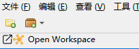
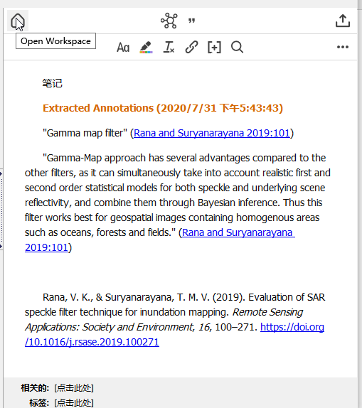
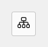
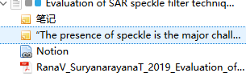
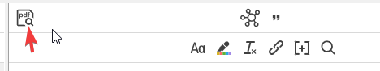
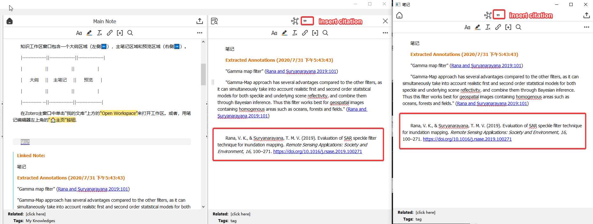
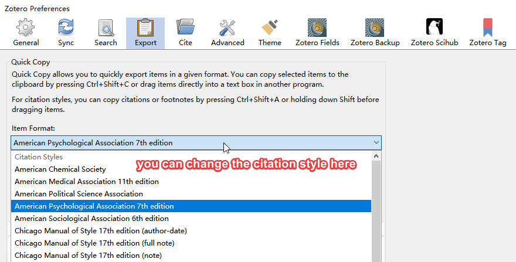
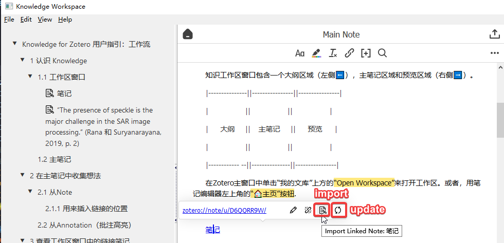
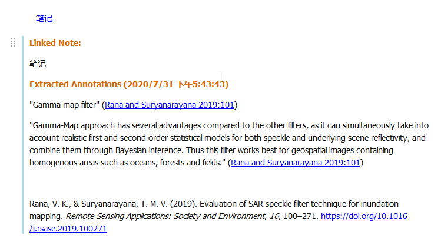
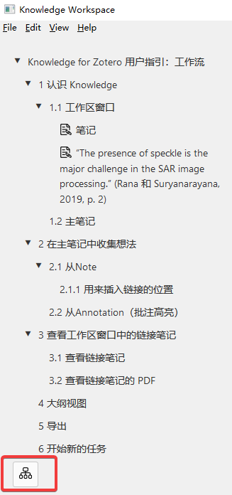

# Zotero Better Notes User Guide: Workflow

Welcome to **Zotero Better Notes** !

This note helps you quickly learn how to use this addon in 3 min!

Let's start now.

## 1 What is Knowledge

Knowledge is an extension of Zotero's built-in note function.

Zotero's note is much like a markdown/rich-text editor. You can edit the format with the tools above⬆️.

### 1.1 Workspace Window

The knowledge workspace window contains an outline area(left side⬅️), the main note area, and the preview area(right side➡️).

Open workspace by clicking the 'Open Workspace' line above the 'My Library' line in Zotero main window. 

Alternatively, open it with the '🏠home' button on the top-left of note editors.

### 1.2 Main note

This addon uses a Zotero note item as the main note. It will show up on the main area of the workspace window.

All links will be added to the main note.

Set current note as the main note:

* Select the current note

* Use right mouse button to set it as the main note

### 1.3 Menu

**File menu**:

* Create a new main notes [shortcut key Ctrl N]

* Open the main note [shortcut key Ctrl O]

* Import notes [shortcut key Ctrl I]

* Export notes [shortcut key Ctrl E]

* Close [shortcut key CTRL W]

**Edit menu**:

* Insert the title

* Reduce the title level

* Improve the title level

**View menu**:

* Tree view

* mind Mapping

* Bubble map

You can also click the icon below to switch view :

**Help menu**:

* Open the user guidance
## 2 Gather Ideas to Main Note

### 2.1 From Note

Select a note outside the workspace window(in Zotero items view or PDF viewer), you may realize a button with the addon's icon on the top of the note editor toolbar.

Click it, the current note link will be inserted into the main note's cursor position;

Select a heading, the note's link will be inserted into the end of this heading.

> **💡 Try it now!**
>
> Open a PDF and open/create a note(in the right side bar of PDF viewer). Add a link below.

### 2.2 From Annotation (including highlight and picture)

You can find a button with the addon's icon on every annotation(in the left sidebar of PDF viewer).

Click it, and a new note with this annotation will be created under the PDF item, and the tag will be shown in the annotation. You can also add the link to the main note in the note editor.

> **💡 Try it now!**
>
> Open a PDF and open/create an annotation(in the left sidebar of PDF viewer). 

### 2.3 Import notes from the menu area

Support to import the notes into the main notes in batches from the existing notes.

* File menu >> Import notes
* or shortcut key cmd/ctrl+I
## 3 Check Linked Notes in Workspace Window

### 3.1 View Linked Notes

Suppose you have added a lot of links to the main note. Now, it's time to view what you've got.

Go back to the workspace window.

Click links with Ctrl, the linked note will show up in the preview area(right side➡️).

> **💡 Try it now!**
>
> Open a note link.

### 3.2 View Linked Note's PDF

Click the '📄PDF' button on the top-left of the preview area.

> **💡 Try it now!**
>
> Open a linked note's PDF.

### 3.3 Inserts a reference format for the parent entry of the current note

Click the "Insert Citation" button in the middle of the preview area.

If you can not quickly insert the citation, you need to set the citation style in the option settings, instead of export format!

### 3.4 Insert the current note to the main note and update in real time

Click the note link, there will be four functions.

After insertion:

## 4 Outline Mode

Switch the outline mode with the '📊mode' button on the bottom of the outline area.

> **💡 Try it now!**
>
> Try different outline modes.

## 5 Export

Click the '⬆️export' button on the top-right of the main note area. Choose a format to export, e.g. MarkDown.

If you are using MS Word/OneNote, export to clipboard and paste there.

> **💡 Try it now!**
>
> Export this main note!

## 6 Start a New Job

After the export, you may want to start a new job with a new empty main note.

Create a note and right-click to set it as the main note, or just create a new main note.

Switch between different main notes by **Open the main note** under the file menu or **Ctrl O**.

> **✨ Hint**
>
> Create a new collection and save all main notes there is the best way to manage them.
>
> The user guide should have done this for you.

Congratulations!

You can select a new main note and start working with **Zotero Better Notes** now. Have fun!
