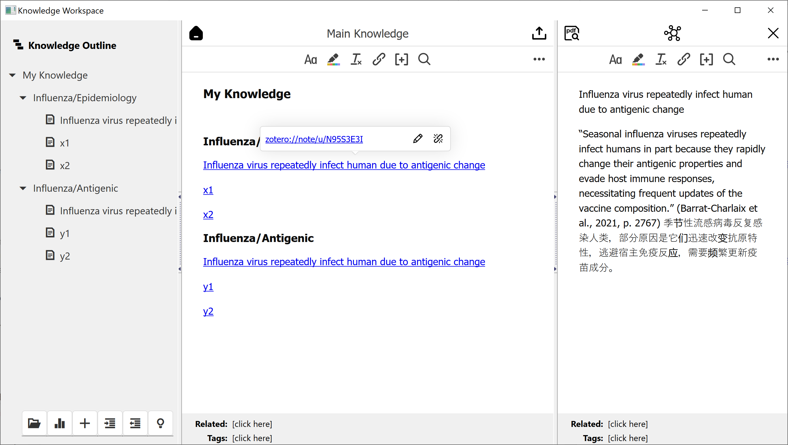
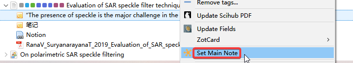
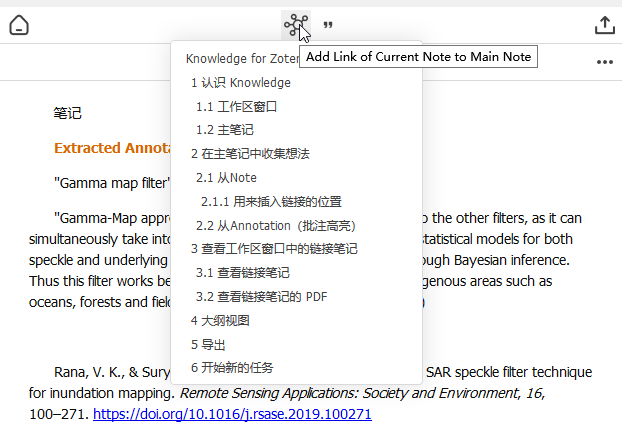
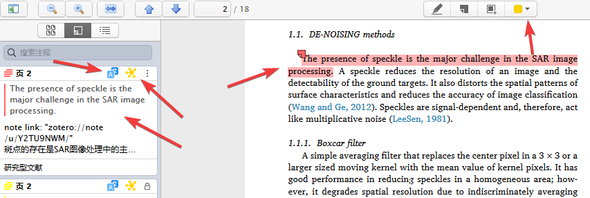
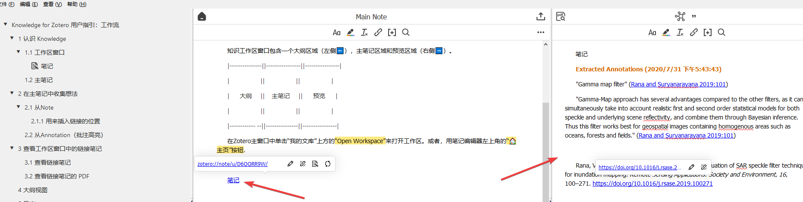
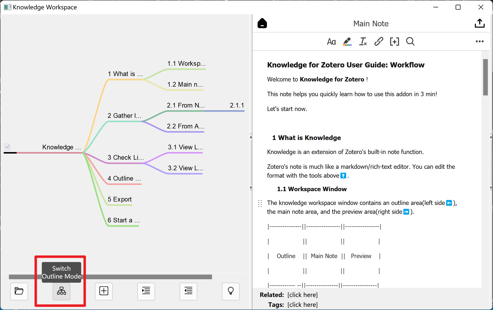
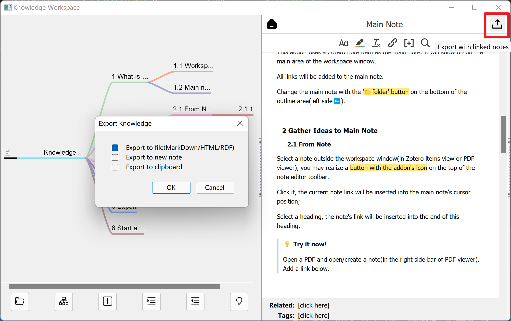

# Knowledge for Zotero 用户指引：工作流

欢迎使用 **Knowledge for Zotero** !

本笔记帮助您在 3 分钟内快速学习如何使用此插件！

现在开始吧。

## 1 认识 Knowledge

Knowledge 是 Zotero 内置 note 功能的扩展。

Zotero 的 note 很像一个标记/富文本编辑器。您可以使用上方工具编辑格式 ⬆️。

### 1.1 工作区窗口

知识工作区窗口包含一个大纲区域（左侧 ⬅️），主笔记区域和预览区域（右侧 ➡️）。

在 Zotero 主窗口中单击“我的文库”上方的“Open Workspace”来打开工作区。或者，用笔记编辑器左上角的“🏠 主页”按钮。

### 1.2 主笔记

这个插件使用某一个 Zotero note 作为主笔记。它将显示在工作区窗口的主笔记区域。

所有链接都将添加到主笔记中。

点击位于大纲区域左下方的 📂“文件夹”按钮 来选择不同的 note 作为主笔记。

## 2 在主笔记中收集想法

### 2.1 从 Note

在工作区窗口外选择一个 note（在 Zotero 条目视图或 PDF 阅读器中），您会在笔记编辑器工具栏顶部看到一个带有本插件图标的按钮。

点击它，当前笔记的链接将插入主笔记的光标位置；

选择一个标题层级，笔记的链接将插入该标题的末尾。

> **💡 尝试一下!**
>
> 打开 PDF 并打开/创建笔记（在 PDF 阅读器的右侧栏中）。用上面的方法在这条主笔记添加一个链接。

#### 2.1.1 用来插入链接的位置

你可以在这里插入链接。

### 2.2 从 Annotation（批注高亮）

你可以在每个批注上找到一个带有插件图标的按钮（在 PDF 阅读器的左侧栏中）。

单击它，PDF 项目下将创建一个带有此批注的新笔记。也可以在打开的笔记编辑器中将链接添加到主笔记。

> **💡 尝试一下!**
>
> 打开 PDF 并打开/创建批注高亮（在 PDF 阅读器的左侧栏中）。用上面的方法在这条主笔记添加一个链接。

## 3 查看工作区窗口中的链接笔记

### 3.1 查看链接笔记

假设你已经在主笔记添加了很多的链接。现在，是时候看看你的结果了。

返回工作区窗口。

单击链接，链接的笔记将显示在预览区域（右侧 ➡️）。

> **💡 尝试一下!**
>
> 在工作区窗口打开一个笔记链接。

### 3.2 查看链接笔记的 PDF

在上一步打开的预览笔记中，点击预览区左上角的“📄PDF”按钮。

> **💡 尝试一下!**
>
> 打开一个链接笔记的 PDF。

## 4 大纲视图

点击大纲区域左下角的 ‘📊 大纲模式‘ 按钮 来切换大纲视图模式。

> **💡 尝试一下!**
>
> 尝试不同的大纲模式（思维导图）

## 5 导出

点击主笔记区域右上角的“⬆️ 导出”按钮。选择要导出的格式，比如 MarkDown。

如果您使用的是 MS Word/OneNote，请导出到剪贴板并粘贴到那里。

> **💡 尝试一下!**
>
> 导出这个主笔记！

## 6 开始新的任务

导出后，您可能希望使用新的空主笔记开始新任务。

创建一个 note 笔记，然后右键单击将其设置为主笔记；或者直接创建一个新的主笔记。

使用大纲区域底部的“📂 文件夹”按钮切换不同的主笔记。

> **✨ 提示**
>
> 创建一个新的文件夹并在其中专门保存所有的主笔记——这是管理主笔记的最佳方法。
>
> 用户指引应该已经为您做到了这一点。

恭喜!

你现在可以选择或新建一个主笔记，然后开始使用 **Knowledge for Zotero**了。用的开心！
